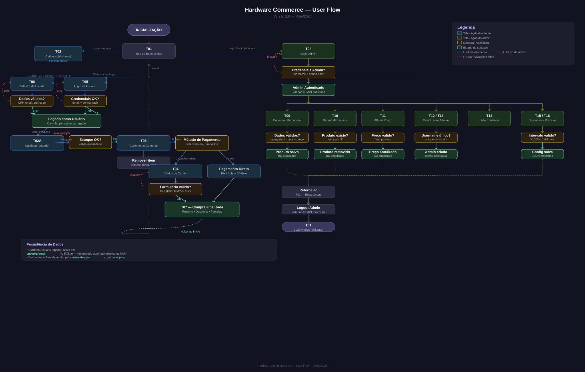

<div align="center">

# HARDWARE COMMERCE

**Aplicação desktop para gerenciamento completo de uma loja de componentes de hardware.**  
Interface gráfica moderna em tema escuro, construída com Python e CustomTkinter.


</div>

## Visão geral

O HARDWARE COMMERCE é um sistema de ponto de venda (PDV) desktop para lojas de hardware. Ele reúne catálogo de produtos, carrinho de compras, processamento de pagamentos e painel administrativo em uma única aplicação leve — sem necessidade de servidor externo ou conexão com internet.

### Funcionalidades principais

| Área | Recursos |
|---|---|
| **Catálogo** | Listagem por categoria, busca em tempo real, filtros por chips |
| **Carrinho** | Adicionar / remover produtos, controle de quantidade, estoque atualizado em tempo real |
| **Pagamento** | 5 métodos (Pix, Boleto, Crédito, Débito, Parcelado), descontos automáticos, parcelamento com juros configurável |
| **Usuários** | Cadastro com CPF validado, autenticação por e-mail e senha, persistência do carrinho entre sessões |
| **Admin** | Cadastrar / remover / editar produtos, configurar descontos e parcelamento, gerenciar administradores |


## Tecnologias

### Linguagem e runtime

| Tecnologia | Versão | Uso |
|---|---|---|
| [Python](https://www.python.org/) | 3.10+ | Linguagem principal |

### Interface gráfica

| Tecnologia | Versão | Uso |
|---|---|---|
| [CustomTkinter](https://github.com/TomSchimansky/CustomTkinter) | 5.2.2 | Widgets modernos sobre Tkinter — tema escuro nativo |
| [darkdetect](https://github.com/albertosottile/darkdetect) | 0.8.0 | Detecção de tema do sistema operacional |

### Banco de dados e ORM

| Tecnologia | Versão | Uso |
|---|---|---|
| [SQLAlchemy](https://www.sqlalchemy.org/) | 2.0.48 | ORM declarativo, gerenciamento de sessões e migrations |
| [SQLite](https://www.sqlite.org/) | embutido no Python | Banco de dados local — arquivo `app/database/database.db` |
| [greenlet](https://greenlet.readthedocs.io/) | 3.3.2 | Dependência interna do SQLAlchemy (concorrência) |

### Segurança

| Tecnologia | Versão | Uso |
|---|---|---|
| [Werkzeug](https://werkzeug.palletsprojects.com/) | 3.0.1 | Hash de senhas (PBKDF2-SHA256) — `generate_password_hash` / `check_password_hash` |

### Utilitários

| Tecnologia | Versão | Uso |
|---|---|---|
| [packaging](https://packaging.pypa.io/) | 26.0 | Gerenciamento de versões de dependências |
| [MarkupSafe](https://markupsafe.palletsprojects.com/) | 3.0.3 | Dependência do Werkzeug |


## Pré-requisitos

- **Python 3.10 ou superior** — [download](https://www.python.org/downloads/)
- **pip** — já incluso no Python 3.4+
- Sistema operacional: Windows 10+, macOS 11+ ou Linux (Ubuntu 20.04+)

> **Não é necessário** instalar banco de dados, servidor ou qualquer dependência de sistema. O SQLite é embutido no Python.

## Instalação e execução

### 1. Clone o repositório

```bash
git clone https://github.com/seu-usuario/sistema-de-loja.git
cd sistema-de-loja
```

### 2. Crie um ambiente virtual

```bash
# Windows
python -m venv .venv
.venv\Scripts\activate

# macOS / Linux
python3 -m venv .venv
source .venv/bin/activate
```

### 3. Instale as dependências

```bash
pip install -r requirements.txt
```

### 4. Execute o sistema

```bash
python main.py
```

O banco de dados (`database.db`) e os arquivos de configuração (`descontos.json`, `parcelas.json`) serão criados automaticamente na primeira execução.

## Primeiro acesso

Na primeira execução, o sistema cria automaticamente:

- **8 categorias** de produtos (Processadores, Placas de Vídeo, Memórias RAM, Air Coolers, Water Coolers, Armazenamento, Fontes de Alimentação, Gabinetes)
- **8 produtos padrão** para demonstração
- **Administrador padrão** com as credenciais abaixo

```
Usuário: admin
Senha:   admin123
```

> ⚠️ **Importante:** altere a senha padrão do admin antes de usar o sistema em produção. Acesse o painel **Configurações → Administradores → Novo admin** para criar um acesso próprio, ou edite diretamente pelo painel admin.


## Guia rápido de uso

### Como cliente

1. Abra o sistema — o catálogo de produtos é exibido automaticamente
2. Use os **filtros de categoria** ou a **barra de busca** para encontrar produtos
3. Clique em **"+ Adicionar ao carrinho"** em qualquer produto
4. Acompanhe o carrinho no painel direito — ajuste quantidades com os botões `+` e `−`
5. Selecione o **método de pagamento** (Pix tem 10% de desconto, Boleto 5%)
6. Clique em **"Finalizar compra"** para ver o resumo do pedido

### Como administrador

1. Clique em **"Admin"** no rodapé da sidebar
2. Entre com as credenciais de administrador
3. Com o modo admin ativo, novos controles aparecem:
   - Botão **"+ Novo produto"** na barra superior
   - Botões **"Editar preço"** e **"Remover"** em cada card de produto
   - Seções **Produtos**, **Usuários** e **Configurações** na sidebar

### Métodos de pagamento e descontos padrão

| Método | Desconto | Parcelamento |
|---|---|---|
| Pix | 10% | Não |
| Boleto | 5% | Não |
| Cartão de Débito | 0% | Não |
| Cartão de Crédito | 0% | Até 12× (3× sem juros, 2% a.m. após) |
| Parcelado | 0% | Até 12× (3× sem juros, 2% a.m. após) |

> Os descontos e regras de parcelamento são **totalmente configuráveis** pelo painel admin em **Configurações**.


## Interface e Design

### Protótipos das telas

O diagrama abaixo apresenta os protótipos de alta fidelidade das principais telas do sistema, com a paleta de cores, componentes e layout exatos da implementação.


> As telas representadas: **Boas-vindas · Catálogo (visitante e logado) · Carrinho · Dados do Cartão · Login · Cadastro · Resumo do Pedido · Painel Admin** (Cadastrar Mercadoria, Configurar Descontos, Listar Usuários, Configurar Parcelamento).

---

### Fluxo do usuário (User Flow)

O diagrama abaixo ilustra a navegação completa do sistema — fluxo do cliente, fluxo do administrador, validações e estados de erro.



---

### Documentação de interface e design system

A documentação detalhada de interface e o guia de estilo estão disponíveis em:

| Documento | Descrição |
|---|---|
| [`docs/documentacao/documentacao-interfaces.md`](docs/documentacao/documentacao-interfaces.md) | Identificação das 16 telas, funcionalidades, regras de navegação e padrões de usabilidade |
| [`docs/guia-estilo/design-system.md`](docs/guia-estilo/design-system.md) | Paleta de cores (tokens), tipografia, componentes, espaçamentos, animações e estados de interface |

#### Telas do sistema

| ID | Tela | Acesso |
|---|---|---|
| T01 | Boas-vindas | Público |
| T02 | Catálogo de Produtos (Visitante) | Público |
| T02A | Catálogo de Produtos (Logado) | Usuário autenticado |
| T03 | Carrinho de Compras | Usuário autenticado |
| T04 | Dados do Cartão / Parcelamento | Usuário autenticado |
| T05 | Login de Usuário | Público |
| T06 | Cadastro de Usuário | Público |
| T07 | Resumo do Pedido | Usuário autenticado |
| T08 | Login Admin | Público |
| T09–T16 | Painel Administrativo (8 telas) | Admin autenticado |

#### Paleta de cores principal

| Uso | Cor | Token |
|---|---|---|
| Fundo principal | `#1e1d2e` | `bg-primary` |
| Sidebar / footer | `#2c2a40` | `bg-secondary` |
| Ação primária | `#860029` | `accent-primary` |
| Sucesso / preços | `#6ee7b7` | `accent-success` |
| Erro / estoque baixo | `#f87171` | `accent-error` |
| Desconto / destaque | `#fbbf24` | `accent-warning` |
| Usuário logado | `#a5b4fc` | `accent-info` |


## Estrutura do projeto

```
SistemaDeLoja/
├── main.py                          # Entry point — inicializa banco e loop principal
├── requirements.txt
├── docs/                            # Documentação de interface
│   ├── prototipos/
│   │   └── telas-hardware-commerce.svg   # Protótipos de alta fidelidade
│   ├── userflow/
│   │   └── user-flow.svg                 # Diagrama de fluxo do usuário
│   ├── documentacao/
│   │   └── documentacao-interfaces.md    # Documentação completa de interface
│   └── guia-estilo/
│       └── design-system.md              # Guia de estilo / Design System
└── app/
    ├── core/
    │   └── carrinho.py              # Camada de Domínio — classe Carrinho e Pedido
    ├── database/
    │   ├── models.py                # ORM: Categoria, Produto, Admin, Usuario, CarrinhoItem
    │   ├── connection.py            # Engine SQLAlchemy + SessionLocal
    │   ├── database.db              # SQLite — gerado em runtime
    │   ├── descontos.json           # Configuração de descontos por método
    │   └── parcelas.json            # Configuração de parcelamento
    ├── services/
    │   ├── produto_service.py       # CRUD de produtos e categorias
    │   ├── carrinho_service.py      # Lógica de adição ao carrinho
    │   ├── usuario_service.py       # Cadastro, login e persistência de carrinho
    │   ├── admin_service.py         # Autenticação e gestão de admins
    │   └── pagamento_service.py     # Descontos, parcelamento e pedidos
    └── ui/
        └── app.py                   # Controlador de menus e interface gráfica
```


## Dependências completas (`requirements.txt`)

```
SQLAlchemy==2.0.48
Werkzeug==3.0.1
customtkinter
```

Para instalar manualmente uma dependência específica:

```bash
pip install SQLAlchemy==2.0.48
pip install Werkzeug==3.0.1
pip install customtkinter
```

---

## Variáveis de configuração

Não há arquivo `.env`. Todas as configurações estão nos arquivos JSON dentro de `app/database/`:

**`descontos.json`** — editável pelo painel admin ou manualmente:
```json
{
  "Cartao de Credito": 0.0,
  "Cartao de Debito": 0.0,
  "Parcelado": 0.0,
  "Boleto": 0.05,
  "Pix": 0.10
}
```

**`parcelas.json`** — editável pelo painel admin ou manualmente:
```json
{
  "max_parcelas": 12,
  "sem_juros_ate": 3,
  "tipo_taxa": "juros",
  "taxa_mensal": 0.02
}
```

## Solução de problemas

**`ModuleNotFoundError: No module named 'customtkinter'`**
```bash
pip install customtkinter
```

**`ModuleNotFoundError: No module named 'sqlalchemy'`**
```bash
pip install SQLAlchemy==2.0.48
```

**A janela não abre no Linux (erro de display)**
```bash
sudo apt-get install python3-tk
```

**O banco de dados corrompeu ou quero resetar tudo**
```bash
rm app/database/database.db
rm app/database/descontos.json
rm app/database/parcelas.json
python main.py
```

**Erro de permissão ao criar o banco no Windows**  
Execute o terminal como administrador ou mova o projeto para uma pasta sem restrições (ex.: `C:\Users\SeuNome\Projetos\`).


## Licença

Este projeto está licenciado sob a [MIT License](LICENSE).


<div align="center">
  Desenvolvido com Python · CustomTkinter · SQLAlchemy · SQLite
</div>
